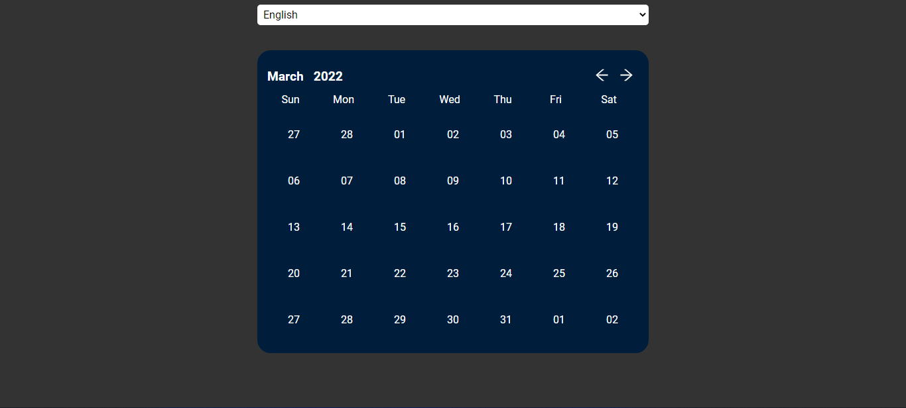

# 📅 React calendar with date-fns

Calendar built in react together with the date-fns library, with the aim of being fully customizable and easy to maintain

## Screenshots

.

## Run

Run on your machine

```bash
  git clone git@github.com:nicolasteofilo/react-calendar-datefns.git
  cd react-calendar-datefns
  yarn npm install
  yarn dev or npm run dev
```

## Authors

- [@nicolasteofilo](https://www.github.com/nicolasteofilo)
